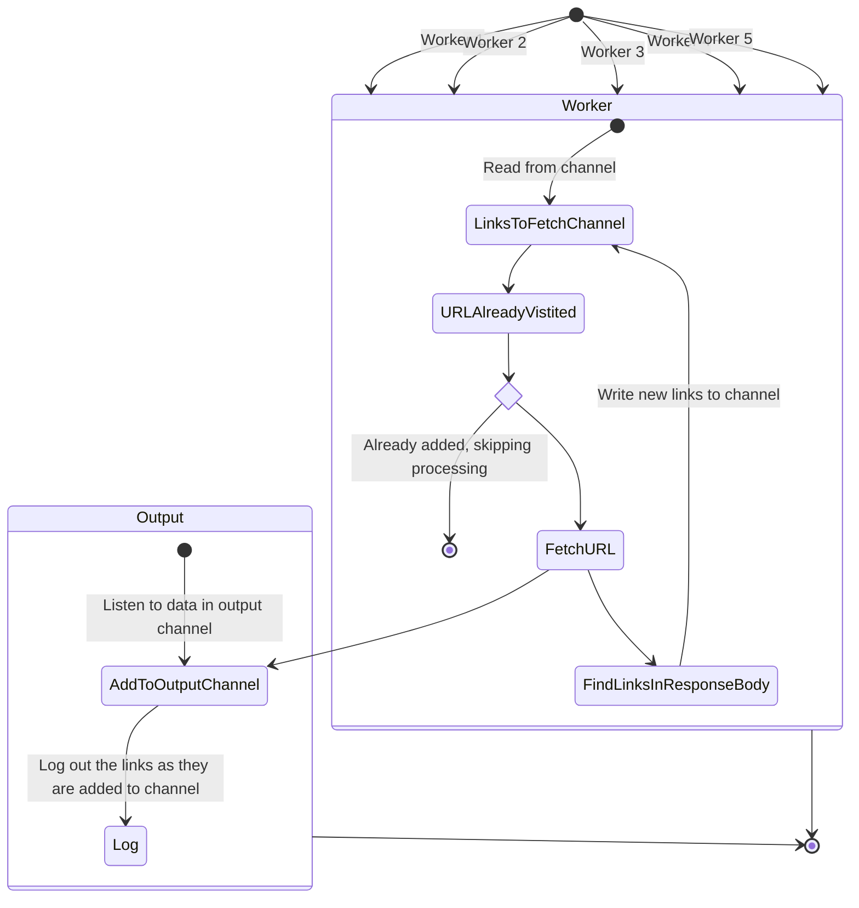

# Web Crawler

[](https://github.com/emmaLP/web-crawler/actions/workflows/build.yaml)

## Scope

Given a starting URL, the crawler should visit each URL it finds on the same domain. It should print each URL visited, and a lists of links found on each page. The crawler will be limited to one domain, but not follow external links or subdomains that don't match the provided domain.

For example the given domain is `https://monzo.com`, the page has URLs suchs as `facebook.com` or `community.monzo.com`, the crawler will not follow these links.

## Architecture / Diagrams

The below diagram is a super rough attempt to document the flow in the code to crawling a website for links and outputting them. I ran out out time to really document the concurrency properly



## Decisions made

### Entrypoint

The solution is written with an entrypoint being a CLI but the main functionality has been seprataed out in order to make it useable in other entrypoints such as an API.

The CLI code passes a output channel to stream the links to the log while the application is processing and fetching any new links found

### Concurrency

This web crawler leverages go channels and go routines to support concurrent processing of fetching found URLs. The max concurrency in the CLI is currently hardcoded to 5 go routines, this could be exposed out in the CLI as a future improvements.

The solution uses 2 channels. One channel leveraged to concurrently find all the URLs using goroutines where each goroutine will fetch a link and if the body contains more links, then the new links are added to this channel.

We have another channel that the CLI uses to print the found links in real time to the console.

## Prerequisites

1.  Golang 1.24

## Running the CLI

### Running locally

Build the CLI excutable:

```bash
make build
```

To crawl a website:

```bash
./bin/crawler crawl monzo.com
```

To see available options:

```bash
./bin/crawler
```

## Notes / Further Improvements

### Notes

This solution will not work when client side dynamically rendered HTML as it can only handle static HTML.
For example, if you try crawl `https://monzo.com`, there no same domain links are found in `a[href]` HTML tags.

As the main `monozo.com` website is dynamically generated, my live testing the CLI was done against the following websites:

- `https://community.monzo.com`
- `https://www.weareink.co.uk`

### Further improvements

1. Adding the ability to run the cli from a docker image. This would allow anyone to run the web crawler without needing to install specific software such as golang
1. Make the the max concurrency number configurable. This is currently hardcoded to 5 in the CLI code.
1. Consider limiting the number of links the process will crawl before exiting out. Currentlt the application will continue to crawl large websites until either the user exits the applications or the application runs out of memory. An example where this could be an issue is if you try crawl `https://www.google.com`
1. The crawling functionality could be extending to be fronted with a Websocket API and a really basic HTML page so a user could load a UI and have the links printed in real time
